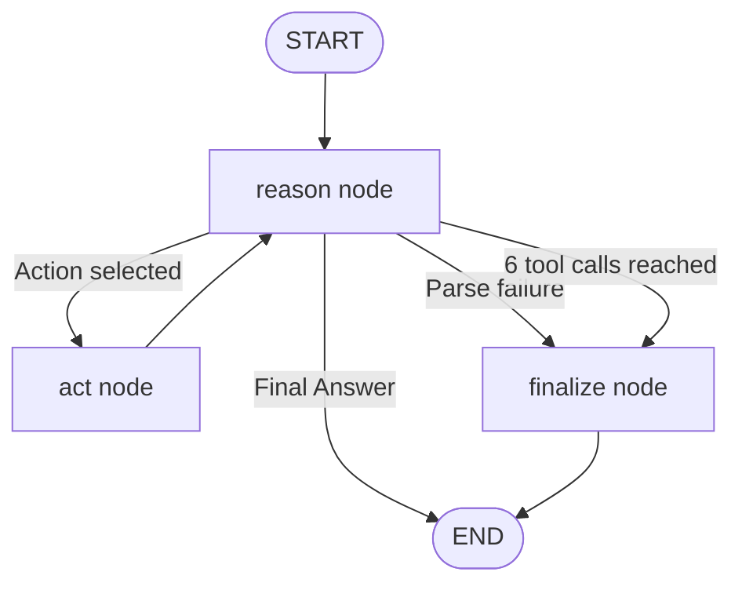

# Assignment 06 — Developer Assist Agent

**Track:** Multi-Agent Systems Engineering · **Difficulty:** Easy · **Marks:** 10 · **Est. time:** ~2.5 hrs

A ReAct developer assistant built with LangGraph. The agent loops through Thought → Action → Observation until it can answer, with a six-tool-call safety guard.

**Problem statement:** [`developer_assist_agent_assignment.md`](developer_assist_agent_assignment.md)

---

## Overview

Engineering teams often need quick answers about effort estimates, stack choices, and documentation summaries. This project implements a **ReAct agent** that reasons step-by-step, calls specialist tools when needed, and prints the full trace to the console so you can see how the agent arrived at its answer.

### What you will practice

- LangGraph `StateGraph` with conditional routing
- ReAct pattern: Thought → Action → Observation → Final Answer
- Tool dispatching and structured LLM response parsing
- Safety guards (max tool calls, parse-error finalisation)
- CLI design with thin entry shim and command handlers

### Tech stack

| Component | Choice |
|-----------|--------|
| Orchestration | LangGraph |
| LLM API | OpenAI (or compatible) |
| Config | python-dotenv + pydantic-settings |
| Tests | pytest (mocked LLM client) |

---

## Project structure

```
06_developer_assist_agent/
├── developer_assist.py              # CLI entry shim: python developer_assist.py
├── data/
│   └── sample_langgraph_readme.txt  # Sample doc for demo query 3
├── app/
│   ├── config.py                    # Paths, help text, and .env loading
│   ├── cli/
│   │   ├── commands.py              # ask + demo command handlers, run_agent
│   │   ├── runner.py                # Argument dispatch and exit codes
│   │   └── output.py                # ReAct trace printing
│   ├── graph/
│   │   ├── state.py                 # AgentState TypedDict
│   │   ├── nodes.py                 # reason / act / finalize nodes
│   │   └── builder.py               # StateGraph wiring
│   ├── schemas/
│   │   └── prompts.py               # ReAct and tool prompt templates
│   └── services/
│       ├── llm_service.py           # OpenAI client wrapper
│       ├── react_parser.py          # Parse Thought/Action/Final Answer
│       ├── tools.py                 # story_estimator, tech_stack_advisor, doc_summariser
│       └── tool_dispatcher.py       # Route actions to tools
├── tests/
├── .env.example
├── developer_assist_agent_assignment.md
├── pytest.ini
├── requirements.txt
└── README.md
```

---

## Architecture



### ReAct loop

1. **reason** — The LLM reads the question and scratchpad, then returns either:
   - `Thought` + `Action` + `Action Input` (call a tool), or
   - `Thought` + `Final Answer` (done)
2. **act** — Dispatches the selected tool, appends the `Observation` to the scratchpad, increments the tool-call counter.
3. **reason** (again) — The LLM synthesises observations and decides the next step.
4. **finalize** — When the six-tool-call budget is exhausted or parsing fails, a final LLM call writes the best available answer from the scratchpad.

### Agent state

| Field | Purpose |
|-------|---------|
| `question` | Original user question |
| `scratchpad` | Accumulated Thoughts, Actions, and Observations |
| `tool_call_count` | Number of tools executed (capped at 6) |
| `pending_action` / `pending_action_input` | Tool queued by the reason node |
| `final_answer` | Answer when the loop stops |
| `stopped_reason` | `final_answer`, `max_iterations`, or `parse_error` |

---

## Prerequisites

- Python 3.10+
- OpenAI API key with billing/credits configured
- Set a small spending limit before running live calls

---

## Setup

```bash
cd "02. Multi-Agent System Engineering/Assignments/06_developer_assist_agent"
python -m venv .venv
.venv\Scripts\activate          # Windows
# source .venv/bin/activate     # macOS / Linux
pip install -r requirements.txt
copy .env.example .env          # Windows
# cp .env.example .env          # macOS / Linux
```

Edit `.env`:

```env
OPENAI_API_KEY=your_openai_api_key_here
OPENAI_MODEL=gpt-4o-mini
```

**Never commit `.env`** — load keys from environment only.

---

## Configuration

Environment variables are loaded from **this assignment's** `.env` file only (`06_developer_assist_agent/.env`). Copy `.env.example` to `.env` in the assignment folder before live runs.

| Variable | Required | Default | Description |
|----------|----------|---------|-------------|
| `OPENAI_API_KEY` | Yes (live runs) | — | OpenAI API key |
| `OPENAI_MODEL` | No | `gpt-4o-mini` | Model for reasoning and tool calls |
| `llm_temperature` | — | `0.0` (hardcoded) | Low temperature for consistent tool routing |

---

## Run

### Ask a single question

```bash
python developer_assist.py "What stack should I use to build a real-time notification system?"
```

**Input:** free-text question (wrap in quotes on the shell).

**Output:** full ReAct trace printed to stdout:

```
Question: What stack should I use to build a real-time notification system?

Thought: ...
Action: tech_stack_advisor
Action Input: real-time notification system
Observation: ...

Final Answer: ...
Stopped: final_answer
```

Exit code `0` on success, `1` if `OPENAI_API_KEY` is missing or the run fails.

### Run all four evaluator sample queries

```bash
python developer_assist.py demo
```

Runs these queries in sequence (query 3 uses the committed `data/sample_langgraph_readme.txt`):

| # | Query | Expected tool(s) |
|---|-------|------------------|
| 1 | Estimate the effort for adding a CSV export feature to the admin dashboard | `story_estimator` |
| 2 | What stack should I use to build a real-time notification system? | `tech_stack_advisor` |
| 3 | Summarise this doc: [sample LangGraph README] | `doc_summariser` |
| 4 | I need to add OAuth login — what tech should I use and how much effort will it take? | `tech_stack_advisor` then `story_estimator` |

### Help

```bash
python developer_assist.py --help
```

---

## Specialist tools

| Tool | Input | Output |
|------|-------|--------|
| `story_estimator` | Feature description | Story points (1, 2, 3, 5, 8, or 13) with a two-sentence rationale |
| `tech_stack_advisor` | Technical requirements | Two or three tool/framework recommendations, each with a one-sentence reason |
| `doc_summariser` | Documentation text | Exactly three one-sentence bullet points |

### Importable functions

```python
from app.graph.builder import build_graph
from app.graph.state import initial_state
from app.services.tools import doc_summariser, story_estimator, tech_stack_advisor

estimate = story_estimator("Add CSV export to admin dashboard")
stack = tech_stack_advisor("real-time notifications with WebSockets")
summary = doc_summariser(open("data/sample_langgraph_readme.txt").read())
```

---

## ReAct trace format

Each loop prints:

```
Thought: <reasoning about what to do next>
Action: <tool_name>
Action Input: <argument string>
Observation: <tool result>

Final Answer: <complete answer to the original question>
Stopped: final_answer
```

### Stop reasons

| `Stopped` value | When it happens |
|-----------------|-----------------|
| `final_answer` | The agent produced a Final Answer in the reason node |
| `max_iterations` | Six tool calls were reached; finalize synthesised from scratchpad |
| `parse_error` | The LLM response did not match the ReAct format |

---

## Failure handling

| Scenario | Behaviour |
|----------|-----------|
| Missing `OPENAI_API_KEY` | `RuntimeError` surfaced to stderr; exit code `1` |
| Unknown tool in LLM response | `ReActParseError` → finalize with `parse_error` |
| Invalid tool output | Observation contains `Tool error: ...`; loop continues |
| Missing sample doc in `demo` | `FileNotFoundError` surfaced to stderr; exit code `1` |

---

## Tests

```bash
pytest tests/ -v
```

Tests mock the OpenAI client — **no live API calls required**.

Coverage includes:

- Config paths and `.env` loading (`tests/app/test_config.py`)
- CLI dispatch, help, demo mode, and error handling (`tests/cli/test_runner.py`)
- LangGraph routing and six-tool-call guard (`tests/graph/test_builder.py`)
- ReAct parsing, tool dispatch, and specialist tool validation (`tests/services/`)

---

## Submission checklist

- [ ] All three tools return correctly formatted outputs
- [ ] Six-iteration guard present and tested
- [ ] Full Thought/Action/Observation trace visible for all four demo queries
- [ ] `python developer_assist.py demo` runs without errors
- [ ] README includes setup, architecture diagram, and sample console transcript
- [ ] `.env` not committed; `data/sample_langgraph_readme.txt` committed

---

## Sample demo transcript

Capture your own output after a live run:

```bash
python developer_assist.py demo
```

Paste the console transcript here for evaluators. Example structure:

```
=== Demo query 1/4 ===

Question: Estimate the effort for adding a CSV export feature...

Thought: ...
Action: story_estimator
Action Input: ...
Observation: ...

Final Answer: ...
Stopped: final_answer

=== Demo query 2/4 ===
...
```
