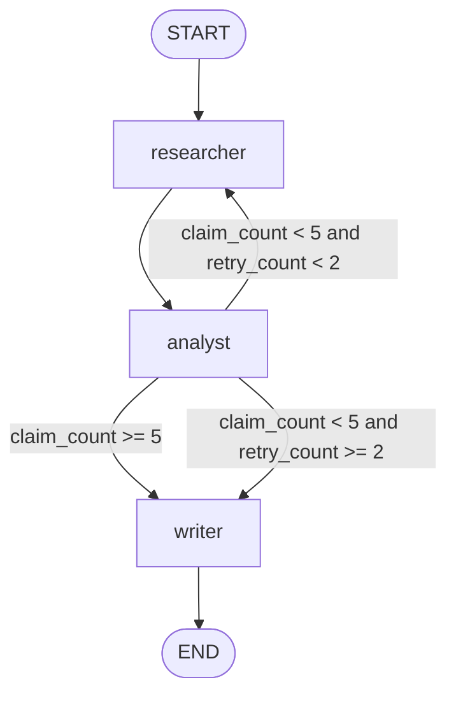

# Assignment 07 — Technical Brief Generator

**Track:** Multi-Agent Systems Engineering · **Difficulty:** Easy · **Marks:** 10 · **Est. time:** ~2.5 hrs

A sequential LangGraph pipeline with a programmatic quality gate — Researcher → Analyst → Writer, looping back to Researcher when research is too shallow.

**Problem statement:** [`technical_brief_generator_assignment.md`](technical_brief_generator_assignment.md)

---

## Overview

Engineering teams need well-researched technical briefs before architecture decisions. This project turns a topic into a structured brief through three specialist nodes. A **quality gate** (implemented as a conditional edge) ensures the Analyst found enough verifiable claims before the Writer runs — preventing superficial outputs without human review.

### What you will practice

- LangGraph sequential pipeline with conditional routing
- Prompt chaining across Researcher, Analyst, and Writer nodes
- Programmatic quality gates (`claim_count`, `retry_count`)
- Structured LLM output parsing (numbered facts, JSON claims)
- CLI design with thin entry shim and command handlers

### Tech stack

| Component | Choice |
|-----------|--------|
| Orchestration | LangGraph |
| LLM API | OpenAI (or compatible) |
| Config | python-dotenv + pydantic-settings |
| Tests | pytest (mocked LLM client) |

---

## Project structure

```
07_technical_brief_generator/
├── brief_generator.py               # CLI entry shim: python brief_generator.py
├── app/
│   ├── config.py                    # Paths, gate thresholds, help text, .env loading
│   ├── cli/
│   │   ├── commands.py              # topic + demo command handlers, run_brief
│   │   ├── runner.py                # Argument dispatch and exit codes
│   │   └── output.py                # Gate / transition printing
│   ├── graph/
│   │   ├── state.py                 # BriefState TypedDict
│   │   ├── nodes.py                 # researcher / analyst / writer
│   │   └── builder.py               # StateGraph + quality gate
│   ├── schemas/
│   │   └── prompts.py               # Node prompt templates
│   └── services/
│       ├── llm_service.py           # OpenAI client wrapper
│       └── brief_parser.py          # Parse facts and analyst JSON
├── tests/
├── .env.example
├── technical_brief_generator_assignment.md
├── pytest.ini
├── requirements.txt
└── README.md
```

---

## Architecture



### Pipeline nodes

| Node | Responsibility |
|------|----------------|
| **Researcher** | Produces a numbered list of at least 7 distinct, specific facts. On retry, adds new facts without repeating prior output. |
| **Analyst** | Distils facts into insights and counts verifiable claims (`claim_count`). |
| **Writer** | Produces a structured brief with Overview, Key Considerations, and Recommendation sections. |

### Agent state

| Field | Purpose |
|-------|---------|
| `topic` | Original topic string |
| `facts` | Numbered facts from the Researcher |
| `insights` / `claims` | Structured output from the Analyst |
| `claim_count` | Number of verifiable claims (gate threshold: 5) |
| `retry_count` | Researcher retries when gate fails (max: 2) |
| `article` | Final brief from the Writer |
| `research_incomplete` | True when Writer ran despite insufficient claims |

---

## Prerequisites

- Python 3.10+
- OpenAI API key with billing/credits configured
- Set a small spending limit before running live calls

---

## Setup

```bash
cd "02. Multi-Agent System Engineering/Assignments/07_technical_brief_generator"
python -m venv .venv
.venv\Scripts\activate          # Windows
# source .venv/bin/activate     # macOS / Linux
pip install -r requirements.txt
copy .env.example .env          # Windows
# cp .env.example .env          # macOS / Linux
```

Edit `.env`:

```env
OPENAI_API_KEY=your_openai_api_key_here
OPENAI_MODEL=gpt-4o-mini
```

**Never commit `.env`** — load keys from environment only.

---

## Configuration

Environment variables are loaded from **this assignment's** `.env` file only (`07_technical_brief_generator/.env`). Copy `.env.example` to `.env` in the assignment folder before live runs.

| Variable | Required | Default | Description |
|----------|----------|---------|-------------|
| `OPENAI_API_KEY` | Yes (live runs) | — | OpenAI API key |
| `OPENAI_MODEL` | No | `gpt-4o-mini` | Model for all pipeline nodes |

| Constant | Value | Description |
|----------|-------|-------------|
| `MIN_CLAIMS` | `5` | Minimum claims for gate to pass |
| `MAX_RETRIES` | `2` | Maximum researcher retries |

---

## Run

### Single topic

```bash
python brief_generator.py "Event-driven architecture"
```

**Input:** free-text topic (wrap in quotes on the shell).

**Output:** pipeline trace and structured brief printed to stdout:

```
Topic: Event-driven architecture

[researcher] claim_count=0, retry_count=0
Facts:
  1. ...
  ...

[analyst] claim_count=5, retry_count=0
[gate] claim_count=5, retry_count=0 -> writer

[writer] claim_count=5, retry_count=0
## Overview
...
```

Exit code `0` on success, `1` if `OPENAI_API_KEY` is missing or the run fails.

### Run both evaluator topics

```bash
python brief_generator.py demo
```

| # | Topic | Expected behaviour |
|---|-------|------------------|
| 1 | Event-driven architecture | Happy path — gate passes first time |
| 2 | GraphQL vs REST APIs | Should trigger at least one retry before writing |

### Help

```bash
python brief_generator.py --help
```

---

## Quality gate

After the Analyst node, a **conditional edge** (not in-node logic) checks:

| Condition | Route |
|-----------|-------|
| `claim_count >= 5` | Writer |
| `claim_count < 5` and `retry_count < 2` | Researcher (retry; `retry_count` increments) |
| `claim_count < 5` and `retry_count >= 2` | Writer with incomplete note |

Each node prints `claim_count` and `retry_count` on entry. The gate line looks like:

```
[gate] claim_count=3, retry_count=0 -> researcher
```

When research is incomplete, the Writer prepends:

```
Research incomplete — only {n} claims found.
```

---

## Brief output format

The Writer produces markdown with exactly these sections:

```markdown
## Overview
(one paragraph, 80–100 words)

## Key Considerations
- (3–5 bullets, one sentence each)

## Recommendation
(one paragraph, 60–80 words with a clear recommendation)
```

### Importable functions

```python
from app.graph.builder import build_graph
from app.graph.state import initial_state
from app.cli.commands import run_brief

result = run_brief("Event-driven architecture")
print(result["article"])
```

---

## Failure handling

| Scenario | Behaviour |
|----------|-----------|
| Missing `OPENAI_API_KEY` | `RuntimeError` surfaced to stderr; exit code `1` |
| `claim_count < 5` after max retries | Writer runs with `Research incomplete` note |
| Invalid analyst JSON | Graph crashes (live runs should use structured prompts) |

---

## Tests

```bash
pytest tests/ -v
```

Tests mock the OpenAI client — **no live API calls required**.

Coverage includes:

- Config paths and `.env` loading (`tests/app/test_config.py`)
- CLI dispatch, help, demo mode, and error handling (`tests/cli/test_runner.py`)
- Quality gate routing (`tests/graph/test_builder.py`)
- Full pipeline: happy path, retry, and incomplete research (`tests/graph/test_graph_integration.py`)
- Fact and analyst JSON parsing (`tests/services/test_brief_parser.py`)

---

## Submission checklist

- [ ] Gate implemented as a conditional edge function (`route_after_analyst`)
- [ ] `claim_count` and `retry_count` printed at each node transition
- [ ] README shows at least one retry cycle in the console transcript
- [ ] Writer brief has Overview, Key Considerations, and Recommendation sections
- [ ] `.env` not committed

---

## Sample demo transcript

Capture your own output after a live run:

```bash
python brief_generator.py demo
```

Paste the console transcript here for evaluators. Example structure:

```
=== Demo topic 1/2 ===

Topic: Event-driven architecture

[researcher] claim_count=0, retry_count=0
...
[gate] claim_count=5, retry_count=0 -> writer
[writer] claim_count=5, retry_count=0
## Overview
...

=== Demo topic 2/2 ===

Topic: GraphQL vs REST APIs

[gate] claim_count=3, retry_count=0 -> researcher
[researcher] claim_count=3, retry_count=1
...
```
