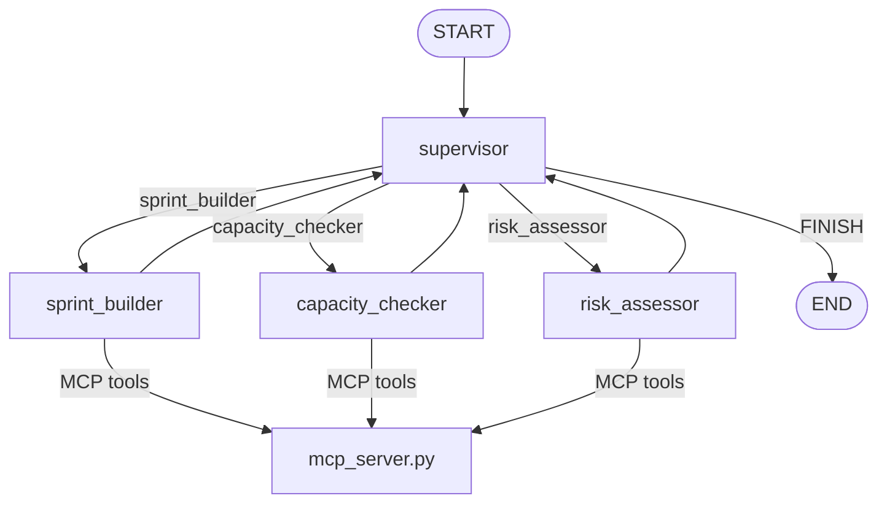

# Assignment 08 — Sprint Planning Assistant

**Track:** Multi-Agent Systems Engineering · **Difficulty:** Medium · **Marks:** 10 · **Est. time:** ~3 hrs

A supervisor agent with FastMCP — routes sprint questions to specialist workers that read and write backlog data through the MCP server.

**Problem statement:** [`sprint_planning_assistant_assignment.md`](sprint_planning_assistant_assignment.md)

---

## Overview

Engineering managers need a planning assistant that handles sprint questions without switching between tools. A **Supervisor** routes each request to the right specialist worker. Workers never share Python objects directly — all backlog reads and writes go through the FastMCP server.

### What you will practice

- LangGraph supervisor pattern with conditional worker routing
- FastMCP tool server and HTTP client wrapper
- Keyword + LLM hybrid routing
- MCP call logging and test doubles
- CLI design with thin entry shim and command handlers

### Tech stack

| Component | Choice |
|-----------|--------|
| Orchestration | LangGraph |
| Tool protocol | FastMCP |
| LLM API | OpenAI (or compatible) |
| Config | python-dotenv + pydantic-settings |
| Tests | pytest (mocked LLM + MCP) |

---

## Project structure

```
08_sprint_planning_assistant/
├── sprint_planner.py                # CLI entry shim: python sprint_planner.py
├── mcp_server.py                    # FastMCP server (4 tools)
├── app/
│   ├── config.py                    # Paths, help text, and .env loading
│   ├── cli/
│   │   ├── commands.py              # request + demo command handlers, run_session
│   │   ├── runner.py                # Argument dispatch and exit codes
│   │   └── output.py                # Routing trace printing
│   ├── graph/
│   │   ├── state.py                 # SprintState TypedDict
│   │   ├── nodes.py                 # supervisor + 3 workers
│   │   └── builder.py               # StateGraph wiring
│   ├── schemas/
│   │   └── prompts.py               # Supervisor and worker prompt templates
│   └── services/
│       ├── llm_service.py           # OpenAI client wrapper
│       ├── mcp_client.py            # MCP protocol client wrapper
│       ├── router.py                # Keyword + LLM supervisor routing
│       └── task_parser.py           # Parse sprint builder JSON
├── tests/
├── .env.example
├── sprint_planning_assistant_assignment.md
├── pytest.ini
├── requirements.txt
└── README.md
```

---

## Architecture



Workers never import backlog state directly — all reads and writes go through `MCPClientWrapper.call_tool()`.

### Agent state

| Field | Purpose |
|-------|---------|
| `requests` | Full list of user requests in the session |
| `request_index` | Index of the current request |
| `current_request` | Request being routed or handled |
| `route` | Supervisor routing decision |
| `worker_result` | Latest worker output |
| `results` | Accumulated worker results |
| `finished` | True when supervisor routes to FINISH |

---

## Prerequisites

- Python 3.10+
- OpenAI API key with billing/credits configured
- Set a small spending limit before running live calls

---

## Setup

```bash
cd "02. Multi-Agent System Engineering/Assignments/08_sprint_planning_assistant"
python -m venv .venv
.venv\Scripts\activate          # Windows
# source .venv/bin/activate     # macOS / Linux
pip install -r requirements.txt
copy .env.example .env          # Windows
# cp .env.example .env          # macOS / Linux
```

Edit `.env`:

```env
OPENAI_API_KEY=your_openai_api_key_here
OPENAI_MODEL=gpt-4o-mini
MCP_SERVER_URL=http://127.0.0.1:8000/mcp
```

**Never commit `.env`** — load keys from environment only.

---

## Configuration

Environment variables are loaded from **this assignment's** `.env` file only (`08_sprint_planning_assistant/.env`). Copy `.env.example` to `.env` in the assignment folder before live runs.

| Variable | Required | Default | Description |
|----------|----------|---------|-------------|
| `OPENAI_API_KEY` | Yes (live runs) | — | OpenAI API key |
| `OPENAI_MODEL` | No | `gpt-4o-mini` | Model for supervisor and workers |
| `MCP_SERVER_URL` | No | `http://127.0.0.1:8000/mcp` | Running MCP server endpoint |

| Constant | Value | Description |
|----------|-------|-------------|
| `DEFAULT_VELOCITY` | `40` | Sprint velocity for capacity checks |
| `MCP_SERVER_PORT` | `8000` | Port used by `mcp_server.py` |

---

## Run

Live runs use **two terminals**. Start the MCP server first, then run the planner.

**Terminal 1 — MCP server (keep running):**

```bash
python mcp_server.py
```

The server listens at `http://127.0.0.1:8000/mcp`.

**Terminal 2 — sprint planner:**

### Single request

```bash
python sprint_planner.py "Check capacity"
```

**Input:** free-text sprint planning request (wrap in quotes on the shell).

**Output:** supervisor routing trace and worker results printed to stdout:

```
=== Sprint planning session ===

Request: Check capacity
[supervisor] route -> capacity_checker

MCP call: check_capacity({'velocity': 40}) -> Sprint is at ...
[capacity_checker] Sprint is at 13/40 SP. Under capacity by 27 SP. Sprint has room for additional items
```

Exit code `0` on success, `1` if `OPENAI_API_KEY` is missing, the MCP server is down, or the run fails.

If the MCP server is not running, you will see:

```
Error: MCP server is not reachable at http://127.0.0.1:8000/mcp.
Start it in a separate terminal first:
  python mcp_server.py
```

### Run all five evaluator requests

```bash
python sprint_planner.py demo
```

| # | Request | Expected worker |
|---|---------|-----------------|
| 1 | Plan OAuth login for the admin dashboard | `sprint_builder` |
| 2 | Check capacity | `capacity_checker` |
| 3 | Any risks in the current sprint? | `risk_assessor` |
| 4 | Add tasks for CSV export on the backlog page | `sprint_builder` |
| 5 | Done | `FINISH` |

### Help

```bash
python sprint_planner.py --help
```

---

## MCP tools

| Tool | Purpose |
|------|---------|
| `get_backlog` | List all sprint tasks with story points and status |
| `add_task` | Add a new todo task (`title`, `assignee`, `story_points`) |
| `check_capacity` | Compare open SP to velocity (default 40) |
| `get_risk_summary` | List medium/high risk tasks |

MCP calls are logged to the console:

```
MCP call: check_capacity({'velocity': 40}) -> Sprint is at 16/40 SP. Under capacity by 24 SP.
```

---

## Supervisor routes

| Request pattern | Worker |
|-----------------|--------|
| Plan / Add tasks / Break down | `sprint_builder` |
| Capacity / SP / Velocity | `capacity_checker` |
| Risks / Blockers / Concerns | `risk_assessor` |
| Done / Quit | `FINISH` |

Routing uses keyword matching first, then LLM classification as fallback.

### Worker behaviour

| Worker | Behaviour |
|--------|-----------|
| **Sprint Builder** | Decomposes a feature into 3–5 tasks via LLM, calls `add_task` for each |
| **Capacity Checker** | Calls `check_capacity`, recommends descoping if over capacity |
| **Risk Assessor** | Calls `get_backlog` + `get_risk_summary`, uses LLM to name 2–3 specific risks |

### Importable functions

```python
from app.graph.builder import build_graph
from app.cli.commands import run_session, DEMO_REQUESTS

result = run_session(["Check capacity"])
print(result["results"])
```

---

## Failure handling

| Scenario | Behaviour |
|----------|-----------|
| Missing `OPENAI_API_KEY` | `RuntimeError` surfaced to stderr; exit code `1` |
| MCP server not running | Clear error with `python mcp_server.py` instructions |
| Invalid sprint builder JSON | `ValueError` if task count is not 3–5 |

---

## Tests

```bash
pytest tests/ -v
```

Tests mock OpenAI and MCP — **no live subprocess required for pytest**.

Coverage includes:

- Config paths and `.env` loading (`tests/app/test_config.py`)
- CLI dispatch, help, demo mode, and error handling (`tests/cli/test_runner.py`)
- Supervisor routing edges (`tests/graph/test_builder.py`)
- Full demo session through all workers (`tests/graph/test_graph_integration.py`)
- Keyword and LLM routing (`tests/services/test_router.py`)
- MCP client errors and test handler (`tests/services/test_mcp_client.py`)

---

## Submission checklist

- [ ] Supervisor routes to all three workers and FINISH
- [ ] Workers use MCP tools only (no direct backlog imports)
- [ ] MCP calls logged to console during live runs
- [ ] `python mcp_server.py` running before `python sprint_planner.py demo`
- [ ] README includes setup, architecture diagram, and console transcript
- [ ] `.env` not committed

---

## Sample demo transcript

Capture your own output after a live run:

```bash
python sprint_planner.py demo
```

Paste the console transcript here for evaluators. Example structure:

```
=== Sprint planning session ===

Request: Plan OAuth login for the admin dashboard
[supervisor] route -> sprint_builder

MCP call: add_task({...}) -> Task added: ...
[sprint_builder] Created 3 tasks for OAuth login: ...

Request: Check capacity
[supervisor] route -> capacity_checker
...
```
