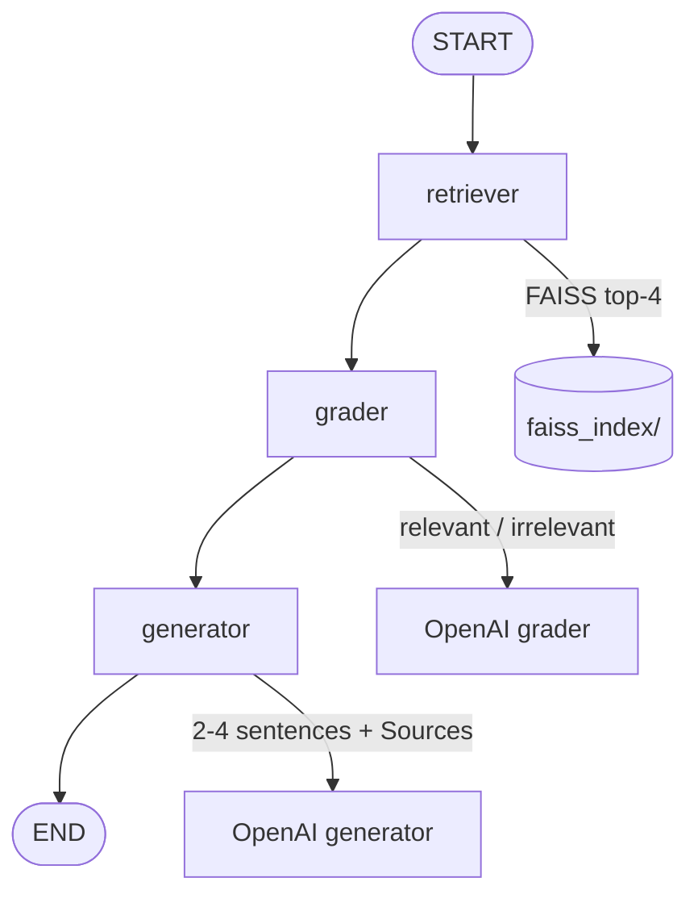

# Assignment 09 — Engineering Knowledge Base Q&A

**Track:** Multi-Agent Systems Engineering · **Difficulty:** Medium · **Marks:** 10 · **Est. time:** ~3 hrs

A corrective RAG assistant with LangGraph and FAISS — retrieve, grade relevance, then generate cited answers from a Wikipedia engineering corpus.

**Problem statement:** [`engineering_knowledge_base_qa_assignment.md`](engineering_knowledge_base_qa_assignment.md)

---

## Overview

Internal engineering assistants often hallucinate when retrieval returns weak neighbors. This project implements **Corrective RAG**: retrieval → relevance grading → grounded generation with citations. Out-of-scope questions never reach the answer model when every chunk is graded irrelevant.

### What you will practice

- LangGraph sequential pipeline (retriever → grader → generator)
- FAISS indexing with OpenAI embeddings
- Wikipedia ingestion and overlapping character chunking
- Binary relevance grading before answer generation
- Citation formatting and insufficient-information handling
- CLI design with thin entry shim and command handlers

### Tech stack

| Component | Choice |
|-----------|--------|
| Orchestration | LangGraph |
| Vector store | FAISS + LangChain |
| Embeddings / LLM | OpenAI |
| Corpus | wikipedia-api |
| Config | python-dotenv + pydantic-settings |
| Tests | pytest (mocked LLM + FAISS) |

---

## Project structure

```
09_engineering_knowledge_base_qa/
├── knowledge_base_qa.py             # CLI entry shim: python knowledge_base_qa.py
├── rebuild_index.py                 # Fetch Wikipedia + build FAISS index
├── app/
│   ├── config.py                    # Paths, chunking, help text, .env loading
│   ├── cli/
│   │   ├── commands.py              # ask + demo command handlers, run_query
│   │   ├── runner.py                # Argument dispatch and exit codes
│   │   └── output.py                # Grading / answer printing
│   ├── graph/
│   │   ├── state.py                 # RAGState TypedDict
│   │   ├── nodes.py                 # retriever / grader / generator
│   │   └── builder.py               # StateGraph wiring
│   ├── schemas/
│   │   └── prompts.py               # Grader and generator prompts
│   └── services/
│       ├── llm_service.py           # OpenAI client wrapper
│       ├── ingestion.py             # Wikipedia fetch + chunking
│       └── vector_store.py          # FAISS save/load/search
├── tests/
├── .env.example
├── engineering_knowledge_base_qa_assignment.md
├── pytest.ini
├── requirements.txt
└── README.md
```

---

## Architecture



### Pipeline nodes

| Node | Behaviour |
|------|-----------|
| **Retriever** | `FAISS.similarity_search(query, k=4)` → `retrieved_docs` |
| **Grader** | Binary relevant/irrelevant per chunk → `relevant_docs` + `grading_trace` |
| **Generator** | 0 / 1 / ≥2 relevant-doc response rules with citations |

### Agent state

| Field | Purpose |
|-------|---------|
| `question` | User query |
| `retrieved_docs` | Top-4 FAISS chunks |
| `relevant_docs` | Chunks that passed grading |
| `grading_trace` | Per-chunk relevant/irrelevant log |
| `answer` | Final grounded response |

---

## Document corpus

Seven Wikipedia articles are fetched, chunked (~500 chars, 50 overlap), embedded with `text-embedding-3-small`, and stored in FAISS:

| # | Article | Topic |
|---|---------|-------|
| 1 | Software engineering | Foundations, lifecycle |
| 2 | Agile software development | Scrum, ceremonies |
| 3 | Continuous integration | CI, trunk-based development |
| 4 | DevOps | Culture, DORA metrics |
| 5 | Technical debt | Refactoring trade-offs |
| 6 | Microservices | Service decomposition |
| 7 | Test-driven development | TDD cycle |

---

## Prerequisites

- Python 3.10+
- OpenAI API key with billing/credits configured
- Set a small spending limit before running live calls / rebuilds

---

## Setup

```bash
cd "02. Multi-Agent System Engineering/Assignments/09_engineering_knowledge_base_qa"
python -m venv .venv
.venv\Scripts\activate          # Windows
# source .venv/bin/activate     # macOS / Linux
pip install -r requirements.txt
copy .env.example .env          # Windows
# cp .env.example .env          # macOS / Linux
```

Edit `.env`:

```env
OPENAI_API_KEY=your_openai_api_key_here
OPENAI_MODEL=gpt-4o-mini
```

**Never commit `.env`** — load keys from environment only.

Build the FAISS index (required before asking questions):

```bash
python rebuild_index.py
```

The `faiss_index/` folder is gitignored — evaluators rebuild with one command.

---

## Configuration

Environment variables are loaded from **this assignment's** `.env` file only (`09_engineering_knowledge_base_qa/.env`).

| Variable | Required | Default | Description |
|----------|----------|---------|-------------|
| `OPENAI_API_KEY` | Yes (live runs / rebuild) | — | OpenAI API key |
| `OPENAI_MODEL` | No | `gpt-4o-mini` | Model for grader and generator |

| Constant | Value | Description |
|----------|-------|-------------|
| `CHUNK_SIZE` | `500` | Characters per chunk |
| `CHUNK_OVERLAP` | `50` | Overlap between chunks |
| `RETRIEVAL_K` | `4` | Top-k FAISS results |
| `EMBEDDING_MODEL` | `text-embedding-3-small` | Embedding model |

---

## Run

### Rebuild index

```bash
python rebuild_index.py
```

### Ask a single question

```bash
python knowledge_base_qa.py "What is trunk-based development and why do teams adopt it?"
```

**Output example:**

```
============================================================
  Engineering KB Q&A
============================================================

Question: What is trunk-based development and why do teams adopt it?

[retriever] retrieved 4 chunks

[grader] grading trace:
  Continuous integration (chunk 12): relevant
  Software engineering (chunk 3): irrelevant
  ...

[generator]
  Trunk-based development keeps a single main branch...
  Sources: [Continuous integration]
```

Exit code `0` on success, `1` if the API key is missing, the index is missing, or the run fails.

### Run all four evaluator queries

```bash
python knowledge_base_qa.py demo
```

| # | Query | Expected |
|---|-------|----------|
| 1 | What is trunk-based development and why do teams adopt it? | In-scope — Continuous integration |
| 2 | How does technical debt accumulate and how should teams address it? | In-scope — Technical debt |
| 3 | What is the difference between microservices and a monolith? | In-scope — multiple sources |
| 4 | What are the current interest rates set by the Federal Reserve? | Out-of-scope → Insufficient information |

### Help

```bash
python knowledge_base_qa.py --help
```

---

## Generator rules

| Relevant docs | Output |
|---------------|--------|
| 0 | `Insufficient information in the knowledge base to answer this question.` |
| 1 | Answer + `Note: only one source available — answer may be incomplete.` |
| ≥2 | Answer in 2–4 sentences + `Sources: [Title 1], [Title 2]` |

### Importable functions

```python
from app.cli.commands import run_query
from app.graph.builder import build_graph

result = run_query("What is trunk-based development and why do teams adopt it?")
print(result["answer"])
print(result["grading_trace"])
```

---

## Failure handling

| Scenario | Behaviour |
|----------|-----------|
| Missing `OPENAI_API_KEY` | `RuntimeError` to stderr; exit code `1` |
| Missing FAISS index | `FileNotFoundError` with `python rebuild_index.py` hint |
| Missing Wikipedia article | `RuntimeError` during rebuild |
| Out-of-scope question | Fixed insufficient-information answer |

---

## Tests

```bash
pytest tests/ -v
```

Tests mock OpenAI and FAISS — **no API key or index required for pytest**.

Coverage includes:

- Config paths and `.env` loading (`tests/app/test_config.py`)
- CLI dispatch, help, demo mode, and missing-index errors (`tests/cli/test_runner.py`)
- Chunk overlap (`tests/services/test_ingestion.py`)
- Out-of-scope / single-source / multi-source graph paths (`tests/graph/test_graph_integration.py`)

---

## Submission checklist

- [ ] FAISS rebuild script committed — no binary index in git
- [ ] Grading trace printed for each query
- [ ] Out-of-scope query returns Insufficient information
- [ ] Citation format includes `Sources: [Title]`
- [ ] README includes setup, diagram, and sample transcript
- [ ] `.env` not committed

---

## Sample demo transcript

Capture your own output after a live run:

```bash
python rebuild_index.py
python knowledge_base_qa.py demo
```

### Sample (query 4 — out of scope)

```
=== Demo query 4/4 ===

Question: What are the current interest rates set by the Federal Reserve?

[retriever] retrieved 4 chunks

[grader] grading trace:
  Software engineering (chunk 0): irrelevant
  DevOps (chunk 5): irrelevant
  Agile software development (chunk 2): irrelevant
  Technical debt (chunk 1): irrelevant

[generator]
  Insufficient information in the knowledge base to answer this question.
```
