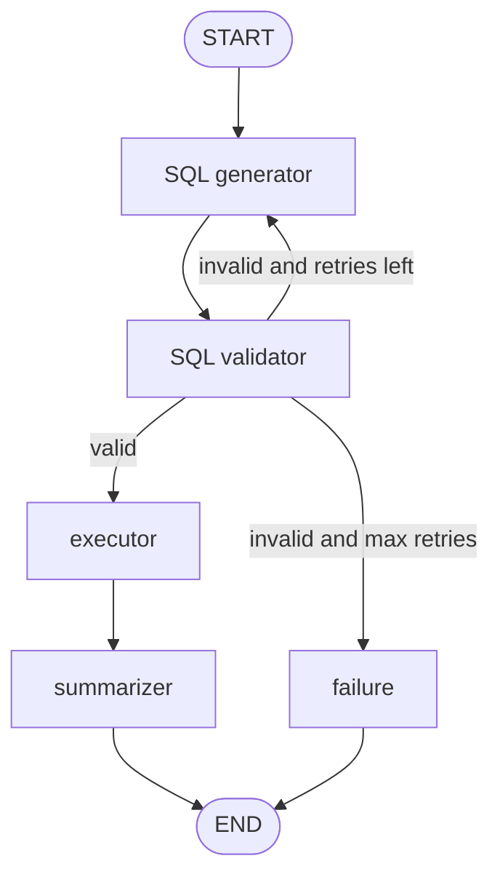

# Assignment 10 — Data Analytics Query Agent

**Track:** Multi-Agent Systems Engineering · **Difficulty:** Medium · **Marks:** 10 · **Est. time:** ~2.5 hrs

A reflection-loop SQL agent with LangGraph — generate SQL, validate it, retry on failure, then return results in plain English.

**Problem statement:** [`data_analytics_query_agent_assignment.md`](data_analytics_query_agent_assignment.md)

---

## Overview

Engineers and managers need instant answers from project data without writing SQL. This agent generates a **SELECT**, validates it for safety and schema correctness, feeds specific errors back to the generator on failure, and only then executes the query.

### What you will practice

- LangGraph reflection pattern (generate → validate → retry)
- Schema-aware SQL generation with OpenAI
- Programmatic SQL validation (forbidden verbs, tables, columns, `EXPLAIN`)
- SQLite seeding and LangChain `SQLDatabase` introspection
- CLI design with thin entry shim and command handlers

### Tech stack

| Component | Choice |
|-----------|--------|
| Orchestration | LangGraph |
| Database | SQLite |
| Schema introspection | LangChain `SQLDatabase` |
| LLM API | OpenAI |
| Config | python-dotenv + pydantic-settings |
| Tests | pytest (temp seeded DB + mocked LLM) |

---

## Project structure

```
10_data_analytics_query_agent/
├── analytics_query.py             # CLI entry shim: python analytics_query.py
├── seed_db.py                     # Create + seed SQLite database
├── app/
│   ├── config.py                  # Paths, retries, help text, .env loading
│   ├── cli/
│   │   ├── commands.py            # ask + demo command handlers, run_query
│   │   ├── runner.py              # Argument dispatch and exit codes
│   │   └── output.py              # Reflection / answer printing
│   ├── graph/
│   │   ├── state.py               # AnalyticsState TypedDict
│   │   ├── nodes.py               # generator / validator / executor / summarizer
│   │   └── builder.py             # StateGraph + retry routing
│   ├── schemas/
│   │   └── prompts.py             # Generator and summarizer prompts
│   └── services/
│       ├── llm_service.py         # OpenAI client wrapper
│       ├── database.py            # SQLDatabase + execute_select
│       ├── sql_validator.py       # Four validation checks
│       └── sql_parser.py          # Extract SQL from LLM text
├── tests/
├── .env.example
├── data_analytics_query_agent_assignment.md
├── pytest.ini
├── requirements.txt
└── README.md
```

---

## Architecture



The agent never executes SQL until the validator passes all checks: forbidden-verb scan, SELECT-only, table existence, column existence, and `sqlite3 EXPLAIN`.

### Agent state

| Field | Purpose |
|-------|---------|
| `question` | Natural-language analytics question |
| `schema_info` | Schema text from `SQLDatabase.get_table_info()` |
| `sql_query` | Latest generated SELECT |
| `validation_error` | Specific validator message (fed back on retry) |
| `retry_count` | Number of failed validation attempts |
| `is_valid` | Whether the latest SQL passed validation |
| `columns` / `rows` | Execution results |
| `summary` / `answer` | Plain-English summary and full formatted answer |

---

## Prerequisites

- Python 3.10+
- OpenAI API key with billing/credits configured
- Set a small spending limit before running live calls

---

## Setup

```bash
cd "02. Multi-Agent System Engineering/Assignments/10_data_analytics_query_agent"
python -m venv .venv
.venv\Scripts\activate          # Windows
# source .venv/bin/activate     # macOS / Linux
pip install -r requirements.txt
copy .env.example .env          # Windows
# cp .env.example .env          # macOS / Linux
```

Edit `.env`:

```env
OPENAI_API_KEY=your_openai_api_key_here
OPENAI_MODEL=gpt-4o-mini
```

**Never commit `.env`** — load keys from environment only.

Seed the database (required before asking questions):

```bash
python seed_db.py
```

`seed_db.py` creates `data/analytics.db` with **3 projects**, **8 tasks**, **4 team members**, and **3 incidents**. The database file is gitignored — evaluators recreate it with one command.

---

## Configuration

Environment variables are loaded from **this assignment's** `.env` file only (`10_data_analytics_query_agent/.env`).

| Variable | Required | Default | Description |
|----------|----------|---------|-------------|
| `OPENAI_API_KEY` | Yes (live runs) | — | OpenAI API key |
| `OPENAI_MODEL` | No | `gpt-4o-mini` | Model for SQL generation and summaries |

| Constant | Value | Description |
|----------|-------|-------------|
| `MAX_RETRIES` | `2` | Max validator-triggered retries |
| `DB_PATH` | `data/analytics.db` | Seeded SQLite path |

---

## Run

### Seed database

```bash
python seed_db.py
```

### Ask a single question

```bash
python analytics_query.py "How many tasks are currently blocked?"
```

**Output example:**

```
============================================================
  Data Analytics Query Agent
============================================================

Question: How many tasks are currently blocked?

[generator] SQL:
  SELECT COUNT(*) FROM tasks WHERE status = 'blocked'

[validator] SQL passed all checks

[answer]
  SQL:
  ```sql
  SELECT COUNT(*) FROM tasks WHERE status = 'blocked'
  ```

  Results:
  Columns: ['COUNT(*)']
  Rows: [(2,)]

  Summary: There are 2 blocked tasks.
```

Exit code `0` on success, `1` if the API key is missing, the database is missing, or the run fails.

### Run all four evaluator queries

```bash
python analytics_query.py demo
```

| Type | Query | Expected SQL pattern |
|------|-------|---------------------|
| COUNT | How many tasks are currently blocked? | `SELECT COUNT(*)` |
| JOIN | List all tasks along with the name of the team member assigned to each | JOIN on tasks and team_members |
| FILTER | Show me all high or critical priority projects | `WHERE` on priority |
| AGGREGATE | What is the average story points per assignee? | `GROUP BY` + `AVG` |

### Help

```bash
python analytics_query.py --help
```

---

## Validator checks

| # | Check | Example error |
|---|-------|---------------|
| 1 | Forbidden verbs | `SQL contains forbidden verb DELETE. Only SELECT statements are permitted` |
| 2 | SELECT-only | `Only SELECT statements are permitted` |
| 3 | Table names | `Table 'employees' does not exist. Available tables: ...` |
| 4 | Column names | `Column 'assigneed' does not exist in table 'tasks'. Available columns: ...` |
| 5 | `sqlite3 EXPLAIN` | `SQL syntax error: ...` |

## Retry policy

- `retry_count` increments on each validation failure
- Up to **2 retries** (3 total generation attempts)
- Validator error is passed back to the generator on each retry
- After max retries: `Unable to generate valid SQL after 2 attempts. Please rephrase your question.`

## Answer format

Every successful response includes three parts:

1. Validated SQL in a code block
2. Raw result rows
3. One plain-English summary sentence

### Importable functions

```python
from app.cli.commands import run_query
from app.graph.builder import build_graph

result = run_query("How many tasks are currently blocked?")
print(result["answer"])
print(result["retry_count"])
```

---

## Failure handling

| Scenario | Behaviour |
|----------|-----------|
| Missing `OPENAI_API_KEY` | `RuntimeError` to stderr; exit code `1` |
| Missing database | `FileNotFoundError` with `python seed_db.py` hint |
| Invalid SQL with retries left | Error printed; generator retries with feedback |
| Still invalid after 2 retries | Fixed failure message returned |

---

## Tests

```bash
pytest tests/ -v
```

Tests use a temporary seeded database and mock OpenAI — **no API key required for pytest**.

Coverage includes:

- Config paths and `.env` loading (`tests/app/test_config.py`)
- CLI dispatch, help, demo mode, and missing-DB errors (`tests/cli/test_runner.py`)
- Seed row counts (`tests/services/test_seed_db.py`)
- Validator forbidden verb / table / column checks (`tests/services/test_sql_validator.py`)
- Retry success and max-retry failure (`tests/graph/test_graph_integration.py`)

---

## Submission checklist

- [ ] `seed_db.py` committed — evaluator recreates DB in one command
- [ ] Validator error messages name the bad column/table/verb
- [ ] At least one retry cycle visible in README transcript
- [ ] Final answer shows SQL + raw result + plain-English summary
- [ ] `.env` not committed

---

## Sample demo transcript (retry cycle)

```
Question: How many tasks are currently blocked?

[generator] SQL:
  SELECT assigneed FROM tasks WHERE status = 'blocked'

[validator] rejected: Column 'assigneed' does not exist in table 'tasks'. Available columns: id, project_id, title, status, assignee, story_points, due_date

[retry 1] validator feedback:
  Column 'assigneed' does not exist in table 'tasks'. Available columns: id, project_id, title, status, assignee, story_points, due_date

[generator] SQL:
  SELECT COUNT(*) FROM tasks WHERE status = 'blocked'

[validator] SQL passed all checks

[answer]
  SQL:
  ```sql
  SELECT COUNT(*) FROM tasks WHERE status = 'blocked'
  ```

  Results:
  Columns: ['COUNT(*)']
  Rows: [(2,)]

  Summary: There are 2 blocked tasks.
```

Capture your own full transcript with:

```bash
python seed_db.py
python analytics_query.py demo
```
