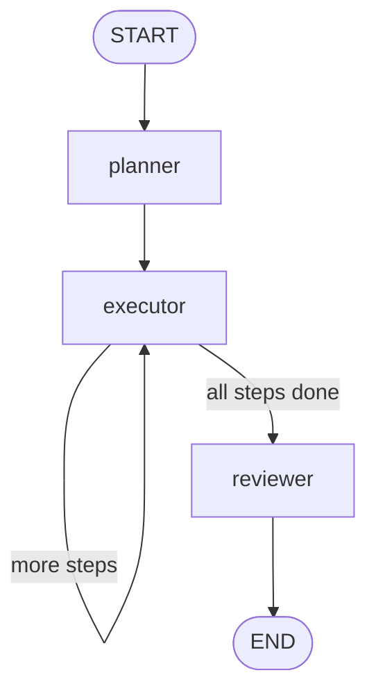

# Assignment 11 — Feature Scoping Agent

**Track:** Multi-Agent Systems Engineering · **Difficulty:** Medium · **Marks:** 10 · **Est. time:** ~3 hrs

A plan-and-execute agent with LangGraph — Planner decomposes a feature into delivery steps, Executor scopes one step per iteration, Reviewer assesses delivery readiness.

**Problem statement:** [`feature_scoping_agent_assignment.md`](feature_scoping_agent_assignment.md)

---

## Overview

Before writing code, features need to be properly scoped: broken into work items with clear outputs and acceptance criteria. This agent takes a feature request, builds an ordered JSON plan (4–6 steps), works through each step producing a technical brief, then reviews the pack for delivery readiness.

### What you will practice

- LangGraph plan-and-execute pattern (planner → executor loop → reviewer)
- Structured JSON planning with schema validation and one parse retry
- Per-step execution with `current_step_idx` and labelled `execution_log`
- Delivery-readiness review (`coverage_score`, `gaps`, `recommendation`)
- CLI design with thin entry shim and command handlers

### Tech stack

| Component | Choice |
|-----------|--------|
| Orchestration | LangGraph |
| LLM API | OpenAI |
| Config | python-dotenv + pydantic-settings |
| Tests | pytest (mocked OpenAI) |

---

## Project structure

```
11_feature_scoping_agent/
├── feature_scoper.py                # CLI entry shim: python feature_scoper.py
├── app/
│   ├── config.py                    # Paths, temps, help text, .env loading
│   ├── cli/
│   │   ├── commands.py              # scope + demo command handlers, run_scope
│   │   ├── runner.py                # Argument dispatch and exit codes
│   │   └── output.py                # Plan / execution / review printing
│   ├── graph/
│   │   ├── state.py                 # ScopeState TypedDict
│   │   ├── nodes.py                 # planner / executor / reviewer
│   │   └── builder.py               # StateGraph + executor loop
│   ├── schemas/
│   │   └── prompts.py               # Planner, executor, and reviewer prompts
│   └── services/
│       ├── llm_service.py           # OpenAI client wrapper
│       └── scope_parser.py          # JSON parsing helpers
├── tests/
├── .env.example
├── feature_scoping_agent_assignment.md
├── pytest.ini
├── requirements.txt
└── README.md
```

---

## Architecture



The planner returns a JSON plan of 4–6 steps. The executor runs **one step per loop iteration**, appends `Step n/total: …` to `execution_log`, and only then routes to the reviewer.

### Agent state

| Field | Purpose |
|-------|---------|
| `request` | Natural-language feature request |
| `plan` | List of steps (`step_name`, `description`, `expected_output`, `acceptance_criteria`) |
| `current_step_idx` | Next step index for the executor loop |
| `execution_log` | Accumulated `Step n/total: …` entries |
| `review` | `coverage_score`, `gaps`, `recommendation` |

### Node behaviour

| Node | Temperature | Output |
|------|-------------|--------|
| Planner | 0.7 | JSON array of 4–6 steps; retries once on JSON parse failure |
| Executor | 0.2 | One step per loop — technical approach, dependencies, effort (`small` / `medium` / `large`) |
| Reviewer | 0.0 | `coverage_score` (1–5), `gaps`, `recommendation` |

---

## Prerequisites

- Python 3.10+
- OpenAI API key with billing/credits configured
- Set a small spending limit before running live calls

---

## Setup

```bash
cd "02. Multi-Agent System Engineering/Assignments/11_feature_scoping_agent"
python -m venv .venv
.venv\Scripts\activate          # Windows
# source .venv/bin/activate     # macOS / Linux
pip install -r requirements.txt
copy .env.example .env          # Windows
# cp .env.example .env          # macOS / Linux
```

Edit `.env`:

| Variable | Required | Default | Description |
|----------|----------|---------|-------------|
| `OPENAI_API_KEY` | Yes | — | OpenAI API key |
| `OPENAI_MODEL` | No | `gpt-4o-mini` | Chat model name |

Config loads **only** this assignment's `.env` (no repo-root fallback).

---

## CLI reference

### Scope one feature

```bash
python feature_scoper.py "Add email notifications when a task's status changes to blocked"
```

### Run both evaluator features

```bash
python feature_scoper.py demo
```

### Help

```bash
python feature_scoper.py --help
```

| Exit code | Meaning |
|-----------|---------|
| 0 | Success (or help shown) |
| 1 | Missing args, API key error, or runtime failure |

---

## Demo features

| Feature | Request |
|---------|---------|
| A | Add email notifications when a task's status changes to blocked |
| B | Build a CSV export for the project backlog with filters by status and assignee |

---

## Sample transcripts

### Feature A — email notifications on blocked status

```
============================================================
  Feature Scoping Agent
============================================================

Feature request: Add email notifications when a task's status changes to blocked

[planner] delivery plan:
[
  {
    "step_name": "Requirements & trigger rules",
    "description": "Clarify who is notified, which status transition fires the email, and quiet hours.",
    "expected_output": "Signed-off notification rules including recipient roles and blocked-status trigger.",
    "acceptance_criteria": "Stakeholders agree on recipients, trigger, and content fields."
  },
  {
    "step_name": "Event & email design",
    "description": "Design the task status event contract and email template / provider integration.",
    "expected_output": "Sequence diagram plus event schema and template outline.",
    "acceptance_criteria": "Design covers blocked-only trigger, template variables, and provider choice."
  },
  {
    "step_name": "Notifier implementation",
    "description": "Subscribe to status-change events and send templated email when status becomes blocked.",
    "expected_output": "Working notifier path in the task service or a dedicated worker.",
    "acceptance_criteria": "Changing a task to blocked enqueues or sends the expected email."
  },
  {
    "step_name": "Reliability & verification",
    "description": "Add retry/idempotency for send failures and automated tests for the blocked path.",
    "expected_output": "Tests plus documented failure handling for the notifier.",
    "acceptance_criteria": "Blocked-status scenarios pass; duplicate events do not spam recipients."
  }
]

[executor] Step 1/4: Technical approach: ... Dependencies: ... Effort: small

[executor] Step 2/4: Technical approach: ... Dependencies: ... Effort: medium

[executor] Step 3/4: Technical approach: ... Dependencies: ... Effort: medium

[executor] Step 4/4: Technical approach: ... Dependencies: ... Effort: small

[reviewer] assessment:
  coverage_score: 4
  gaps:
    - Retry / backoff policy for SMTP or provider outages
  recommendation: Approved for development
```

### Feature B — backlog CSV export with filters

```
Feature request: Build a CSV export for the project backlog with filters by status and assignee

[planner] delivery plan:
[
  {
    "step_name": "Export requirements",
    "description": "Define columns, filter semantics for status/assignee, and auth to run export.",
    "expected_output": "Export spec with column list and filter behaviour.",
    "acceptance_criteria": "Product agrees on columns, empty-result behaviour, and who can export."
  },
  {
    "step_name": "Query & API design",
    "description": "Design the filtered backlog query and download endpoint/contract.",
    "expected_output": "API/contract note covering filters, pagination or streaming, and CSV shape.",
    "acceptance_criteria": "Design supports status + assignee filters and large backlogs safely."
  },
  {
    "step_name": "CSV export implementation",
    "description": "Implement filtered query and CSV serialisation with the agreed columns.",
    "expected_output": "Working export endpoint or CLI that returns a CSV file.",
    "acceptance_criteria": "Export respects status and assignee filters and matches the column spec."
  },
  {
    "step_name": "Validation & rollout checks",
    "description": "Cover edge cases (no matches, special characters) and document how to verify in staging.",
    "expected_output": "Automated tests plus a short verification checklist.",
    "acceptance_criteria": "Filter and encoding cases pass; checklist covers a staging dry-run."
  }
]

[executor] Step 1/4: ... Effort: small
[executor] Step 2/4: ... Effort: medium
[executor] Step 3/4: ... Effort: medium
[executor] Step 4/4: ... Effort: small

[reviewer] assessment:
  coverage_score: 4
  gaps:
    - Explicit handling for very large exports (streaming or async job)
  recommendation: Approved for development
```

Run `python feature_scoper.py demo` with a valid `.env` to capture your own full live transcript for submission.

---

## Tests

```bash
python -m pytest tests/ -v
```

| Area | Coverage |
|------|----------|
| Config | Paths, `.env` loading, defaults, cached settings, demo features |
| CLI | Missing args, `--help`, demo mode, API-key errors |
| Graph | Full executor loop before reviewer; planner JSON retry |
| Parser | Plan / executor / review JSON validation |

Tests mock OpenAI — no live API calls required for pytest.

---

## Submission checklist

- [ ] Plan JSON printed as formatted output
- [ ] Execution steps labelled (`Step 1/5`, `Step 2/5`, …) in console
- [ ] Reviewer output shows `coverage_score` + `gaps` + `recommendation`
- [ ] Both test features documented in README
- [ ] `pytest tests/ -v` passes
- [ ] Do not commit `.env`
