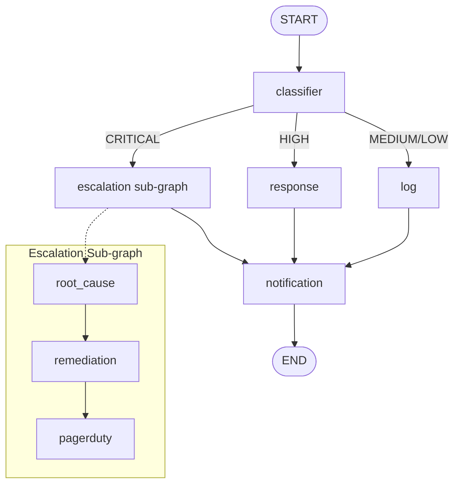

# Assignment 12 — On-Call Incident Handler

**Track:** Multi-Agent Systems Engineering · **Difficulty:** Hard · **Marks:** 10 · **Est. time:** ~3 hrs

Nested agents with agentic memory — main graph routes incidents by severity, an escalation sub-graph handles CRITICAL cases, and MemorySaver persists shift history across calls.

**Problem statement:** [`oncall_incident_handler_assignment.md`](oncall_incident_handler_assignment.md)

---

## Overview

On-call engineers handle a stream of incidents during a shift. This agent remembers the shift's history, escalates critical issues through a deeper triage process, and spots patterns across related incidents (e.g. INC-003 cross-referencing INC-001 on the same service).

### What you will practice

- LangGraph nested agents (main graph + separately compiled escalation sub-graph)
- Agentic memory with `MemorySaver` and a shared `thread_id`
- Severity-based routing (CRITICAL / HIGH / MEDIUM-LOW)
- Same-service cross-references from `incident_history`
- CLI design with thin entry shim and command handlers

### Tech stack

| Component | Choice |
|-----------|--------|
| Orchestration | LangGraph |
| Memory | LangGraph `MemorySaver` |
| LLM API | OpenAI |
| Config | python-dotenv + pydantic-settings |
| Tests | pytest (mocked OpenAI + MemorySaver) |

---

## Project structure

```
12_oncall_incident_handler/
├── incident_handler.py              # CLI entry shim: python incident_handler.py
├── data/
│   ├── incident_01.json             # CRITICAL — payment-gateway
│   ├── incident_02.json             # HIGH — user-auth
│   └── incident_03.json             # MEDIUM — payment-gateway (cross-ref INC-001)
├── app/
│   ├── config.py                    # Paths, thread id, roster, .env loading
│   ├── cli/
│   │   ├── commands.py              # incident + demo handlers, run_incident
│   │   ├── runner.py                # Argument dispatch and exit codes
│   │   └── output.py                # Classifier / escalation / memory printing
│   ├── graph/
│   │   ├── main_graph/
│   │   │   ├── state.py             # IncidentState + MemorySaver reducer
│   │   │   ├── nodes.py             # classifier / response / log / notification
│   │   │   └── builder.py           # main graph with checkpointer
│   │   └── escalation_graph/
│   │       ├── escalation_state.py
│   │       ├── escalation_nodes.py  # root_cause / remediation / pagerduty
│   │       └── escalation_builder.py  # separate escalation StateGraph
│   ├── schemas/
│   │   └── prompts.py               # Root-cause, remediation, response, notification
│   └── services/
│       ├── llm_service.py           # OpenAI client wrapper
│       ├── incident_loader.py       # JSON load + validation
│       └── incident_memory.py       # history + cross-reference helpers
├── tests/
├── .env.example
├── oncall_incident_handler_assignment.md
├── pytest.ini
├── requirements.txt
└── README.md
```

---

## Architecture



### Agent state (main graph)

| Field | Purpose |
|-------|---------|
| `incident` / extracted fields | Current incident payload |
| `route` | `critical` / `high` / `medium_low` |
| `incident_history` | Accumulated one-line summaries (`operator.add` + MemorySaver) |
| `cross_reference` | Same-service note when history already contains the service |
| `response_plan` / `log_message` / `escalation_output` | Path-specific action text |
| `notification` | Final 2-sentence summary |
| `roster_index` | Round-robin index into the on-call roster |

---

## Prerequisites

- Python 3.10+
- OpenAI API key with billing/credits configured
- Set a small spending limit before running live calls

---

## Setup

```bash
cd "02. Multi-Agent System Engineering/Assignments/12_oncall_incident_handler"
python -m venv .venv
.venv\Scripts\activate          # Windows
# source .venv/bin/activate     # macOS / Linux
pip install -r requirements.txt
copy .env.example .env          # Windows
# cp .env.example .env          # macOS / Linux
```

Edit `.env`:

| Variable | Required | Default | Description |
|----------|----------|---------|-------------|
| `OPENAI_API_KEY` | Yes | — | OpenAI API key |
| `OPENAI_MODEL` | No | `gpt-4o-mini` | Chat model name |

Config loads **only** this assignment's `.env` (no repo-root fallback).

Sample incidents live under `data/` (`incident_01.json` … `incident_03.json`).

---

## CLI reference

### Handle one incident

```bash
python incident_handler.py data/incident_01.json
# also accepts: python incident_handler.py incident_01.json
```

### Run all three on the same shift thread

```bash
python incident_handler.py demo
```

### Help

```bash
python incident_handler.py --help
```

| Exit code | Meaning |
|-----------|---------|
| 0 | Success (or help shown) |
| 1 | Missing args, missing file, API key error, or runtime failure |

All calls use `thread_id = 'shift-2024-11-15'` so `incident_history` persists across the demo.

---

## Routing

| Severity | Path |
|----------|------|
| CRITICAL | Escalation sub-graph → notification |
| HIGH | Response plan (3 action steps) → notification |
| MEDIUM / LOW | Watch-list log → notification |

## Escalation sub-graph

Compiled separately via `build_escalation_graph()`:

| Node | Output |
|------|--------|
| root_cause | Hypothesis + 3 evidence bullets |
| remediation | 5 prioritised steps with time estimates |
| pagerduty | Formatted alert with round-robin on-call assignee |

On-call roster (round-robin): Alice Chen → Bob Kumar → Carol Smith

## Agentic memory

- Main graph compiled with `MemorySaver()` checkpointer
- Classifier appends a one-line summary to `incident_history` each call
- When a service repeats in the same shift, output includes a cross-reference note
- INC-003 (`payment-gateway`) references INC-001 after two prior incidents

---

## Sample memory transcript (INC-003)

```
============================================================
  On-Call Incident Handler
============================================================

=== Handling INC-003 (thread: shift-2024-11-15) ===

[classifier] INC-003 | medium | payment-gateway -> route: medium_low
[memory] Note: This is the second payment-gateway incident this shift. INC-001 involved DB connection pool exhausted — check if root cause is related.
[log] Note: This is the second payment-gateway incident this shift. INC-001 involved DB connection pool exhausted — check if root cause is related.
INC-003 logged for monitoring. No immediate action required. Added to watch list: payment-gateway elevated 503 rate post-recovery.

[notification] ...

[memory] incident_history:
  - INC-001 | critical | payment-gateway | DB connection pool exhausted
  - INC-002 | high | user-auth | JWT key rotation failed
  - INC-003 | medium | payment-gateway | Elevated 503 rate post-recovery
```

Run `python incident_handler.py demo` with a valid `.env` to capture your own full transcript for submission.

---

## Tests

```bash
python -m pytest tests/ -v
```

| Area | Coverage |
|------|----------|
| Config | Paths, `data/` incidents, thread id, roster, `.env` loading |
| CLI | Missing args, `--help`, demo, basename resolve, API-key errors |
| Graph | Memory cross-ref on INC-003; CRITICAL → escalation |
| Escalation | Root cause + remediation + PagerDuty alert format |
| Memory helpers | Cross-reference + watch-list log wording |

Tests mock OpenAI — no live API calls required for pytest.

---

## Submission checklist

- [ ] All 3 incident JSON files committed under `data/`
- [ ] Escalation sub-graph as a separate StateGraph object (not inline logic)
- [ ] `thread_id = 'shift-2024-11-15'` in all 3 calls
- [ ] PagerDuty output shows correct format with round-robin roster
- [ ] README shows `incident_history` at each call and INC-003 cross-reference
- [ ] `pytest tests/ -v` passes
- [ ] Do not commit `.env`
