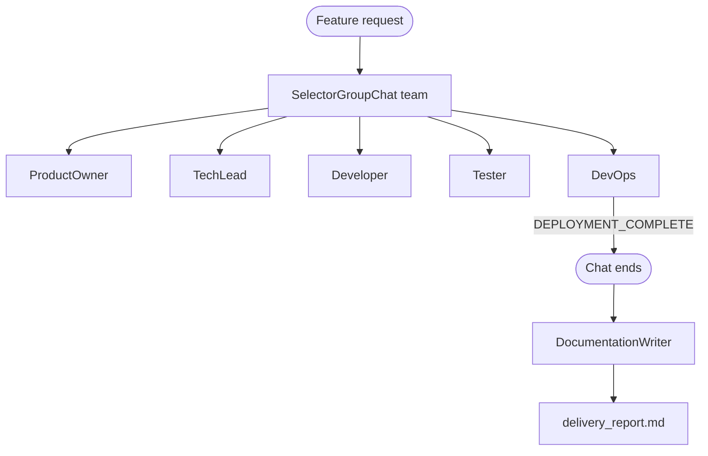

# Assignment 13 — AI-Powered Delivery Team

**Track:** Multi-Agent Systems Engineering · **Difficulty:** Hard · **Marks:** 10 · **Est. time:** ~3 hrs

An AutoGen group chat simulating a software delivery team — five role agents collaborate on a feature, then a Documentation Writer produces `delivery_report.md` from the transcript.

**Problem statement:** [`ai_powered_delivery_team_assignment.md`](ai_powered_delivery_team_assignment.md)

---

## Overview

Simulate taking a feature from brief to staging deployment. ProductOwner, TechLead, Developer, Tester, and DevOps work in a managed group chat; DocumentationWriter runs only after the chat terminates on `DEPLOYMENT_COMPLETE`.

### What you will practice

- AutoGen `SelectorGroupChat` (auto speaker selection)
- Distinct role system messages with mandatory cross-agent name references
- Text-mention termination (`DEPLOYMENT_COMPLETE`)
- Post-chat documentation agent with a structured five-section report
- CLI design with thin entry shim and command handlers

### Tech stack

| Component | Choice |
|-----------|--------|
| Multi-agent runtime | AutoGen AgentChat (`SelectorGroupChat`) |
| Model client | `autogen-ext` OpenAI |
| LLM API | OpenAI |
| Config | python-dotenv + pydantic-settings |
| Tests | pytest + pytest-asyncio (mocked chat / report) |

---

## Project structure

```
13_ai_powered_delivery_team/
├── delivery_team.py                 # CLI entry shim: python delivery_team.py
├── transcript.txt                   # sample / generated chat transcript
├── delivery_report.md               # sample / generated report
├── app/
│   ├── config.py                    # Paths, rounds, feature request, .env loading
│   ├── cli/
│   │   ├── commands.py              # run_simulation / cmd_run handlers
│   │   ├── runner.py                # Argument dispatch and exit codes
│   │   └── output.py                # Transcript / report printing
│   ├── agents/
│   │   ├── definitions.py           # AutoGen agent factories
│   │   └── group_chat.py            # SelectorGroupChat runner
│   ├── schemas/
│   │   └── agent_prompts.py         # Six distinct system messages
│   └── services/
│       ├── transcript.py            # Message → text formatting
│       ├── report_writer.py         # DocumentationWriter + section validation
│       └── delivery_runner.py       # End-to-end orchestration
├── tests/
├── .env.example
├── ai_powered_delivery_team_assignment.md
├── pytest.ini
├── requirements.txt
└── README.md
```

---

## Architecture



This project uses **autogen-agentchat** (`SelectorGroupChat`), the current AutoGen API equivalent of legacy `GroupChatManager` with `speaker_selection_method='auto'`.

### Feature under delivery

> Add real-time task status notifications so that team members are instantly alerted via the app when any of their assigned tasks are updated.

### Agents

| Agent | In group chat? | Responsibility |
|-------|----------------|----------------|
| ProductOwner | Yes | Given/When/Then acceptance criteria |
| TechLead | Yes | Architecture, stack choice, review |
| Developer | Yes | Pseudocode for core components |
| Tester | Yes | 5 test cases tied to the design |
| DevOps | Yes | Docker/deploy config + `DEPLOYMENT_COMPLETE` |
| DocumentationWriter | No | Post-chat report from transcript |

### Group chat settings

| Setting | Value |
|---------|-------|
| max_turns | 15 |
| speaker selection | auto (`SelectorGroupChat` LLM selector) |
| termination | `DEPLOYMENT_COMPLETE` |

---

## Prerequisites

- Python 3.10+
- OpenAI API key with billing/credits configured
- Set a small spending limit before running live calls (group chat is multi-turn)

---

## Setup

```bash
cd "02. Multi-Agent System Engineering/Assignments/13_ai_powered_delivery_team"
python -m venv .venv
.venv\Scripts\activate          # Windows
# source .venv/bin/activate     # macOS / Linux
pip install -r requirements.txt
copy .env.example .env          # Windows
# cp .env.example .env          # macOS / Linux
```

Edit `.env`:

| Variable | Required | Default | Description |
|----------|----------|---------|-------------|
| `OPENAI_API_KEY` | Yes | — | OpenAI API key |
| `OPENAI_MODEL` | No | `gpt-4o-mini` | Chat model name |

Config loads **only** this assignment's `.env` (no repo-root fallback).

---

## CLI reference

### Run with the evaluator sample feature

```bash
python delivery_team.py
python delivery_team.py --save
```

### Run with your own feature request

```bash
python delivery_team.py "Add OAuth login for GitHub accounts"
python delivery_team.py --save "Add CSV export for the backlog"
```

If you omit the feature text, the built-in evaluator request is used. `--save` writes fresh `transcript.txt` and `delivery_report.md` from the live run.

### Help

```bash
python delivery_team.py --help
```

| Exit code | Meaning |
|-----------|---------|
| 0 | Success (or help shown) |
| 1 | Unknown flag, API key error, or missing report sections |

---

## Report sections

`delivery_report.md` must include:

1. Executive Summary  
2. Technical Design  
3. Test Coverage  
4. Deployment Configuration  
5. Open Questions  

---

## Tests

```bash
python -m pytest tests/ -v
```

| Area | Coverage |
|------|----------|
| Config | Paths, rounds, feature request, `.env` loading, cached settings |
| CLI | `--help`, default run, `--save`, unknown flags, API-key errors |
| Prompts | Distinct role messages, name-reference rule, DevOps token |
| Orchestration | Async run + artifact save |
| Report | Committed sample has all sections; missing-section detection |

Tests mock the group chat and report writer — no API key required for pytest.

---

## Group chat vs sequential (~150 words)

A **sequential pipeline** fixes agent order: ProductOwner always runs before TechLead, then Developer, and so on. That is predictable and easy to debug, but agents cannot react to unexpected contributions — Tester might specify cases before Developer proposes APIs, forcing rework or generic output.

**Group chat** lets a manager model pick the next speaker from conversation context. TechLead can respond directly after Developer, and DevOps speaks only when deployment is relevant. Cross-references emerge naturally because every agent sees prior messages. The trade-off is higher token cost, less deterministic ordering, and a hard termination rule (`DEPLOYMENT_COMPLETE`) to prevent endless discussion.

For delivery simulation, group chat better models how real teams interrupt, review, and unblock each other. Sequential flows suit ETL-style workflows where each stage has a strict input contract.

---

## Submission checklist

- [ ] `transcript.txt` and `delivery_report.md` committed
- [ ] All 6 agent `system_messages` are distinct and role-appropriate
- [ ] TechLead's architecture choices are visible in Developer and Tester outputs
- [ ] README includes group chat vs sequential comparison
- [ ] `pytest tests/ -v` passes
- [ ] Do not commit `.env`

Committed sample files demonstrate the expected format. Run `python delivery_team.py --save` with your API key to regenerate them from a live simulation.
