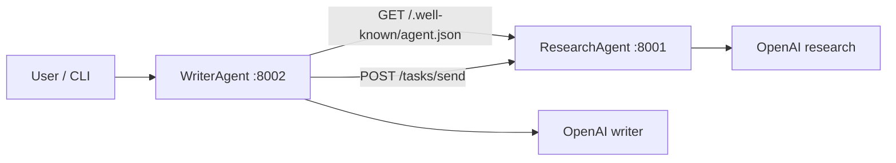

# Assignment 14 — Cross-Agent Research via A2A Protocol

**Track:** Multi-Agent Systems Engineering · **Difficulty:** Hard · **Marks:** 10 · **Est. time:** ~3 hrs

Two independent agent services collaborate over HTTP — ResearchAgent exposes A2A endpoints; WriterAgent discovers it, delegates research, and writes a ~300-word engineering brief.

**Problem statement:** [`cross_agent_research_a2a_assignment.md`](cross_agent_research_a2a_assignment.md)

---

## Overview

MCP connects one agent to tools. A2A connects one agent to another autonomous agent. This project implements the A2A handshake locally: AgentCard discovery, task delegation via `/tasks/send`, and result retrieval — with a LangGraph WriterAgent that turns research into a brief.

### What you will practice

- A2A AgentCard discovery (`/.well-known/agent.json`)
- Task delegation and polling endpoints on an independent FastAPI service
- LangGraph orchestration (discovery → delegation → writer)
- httpx-based cross-service calls with visible server logs
- A2A vs MCP trade-offs in documentation

### Tech stack

| Component | Choice |
|-----------|--------|
| ResearchAgent | FastAPI + OpenAI (port 8001) |
| WriterAgent | FastAPI + LangGraph + httpx (port 8002 / CLI) |
| LLM API | OpenAI |
| Config | python-dotenv + pydantic-settings |
| Tests | pytest (mocked OpenAI + httpx) |

---

## Project structure

```
14_cross_agent_research_a2a/
├── research_agent.py                # A2A server entry (port 8001)
├── writer_agent.py                  # Writer FastAPI + CLI entry (port 8002)
├── app/
│   ├── config.py                    # Ports, URLs, help text, .env loading
│   ├── cli/
│   │   ├── commands.py              # topic + demo handlers, run_brief
│   │   ├── runner.py                # Writer CLI dispatch
│   │   └── output.py                # Discovery / delegation / article printing
│   ├── graph/
│   │   ├── state.py                 # WriterState TypedDict
│   │   ├── nodes.py                 # discovery / delegation / writer
│   │   └── builder.py               # StateGraph wiring
│   ├── schemas/
│   │   └── prompts.py               # Research + writer prompts
│   └── services/
│       ├── llm_service.py           # OpenAI client wrapper
│       ├── agent_card.py            # AgentCard builder
│       ├── task_store.py            # In-memory A2A task results
│       └── a2a_client.py            # httpx discovery + delegation
├── tests/
├── .env.example
├── cross_agent_research_a2a_assignment.md
├── pytest.ini
├── requirements.txt
└── README.md
```

---

## Architecture



### WriterAgent graph

| Node | Behaviour |
|------|-----------|
| discovery | `GET` AgentCard via httpx; logs name, version, skills |
| delegation | `POST /tasks/send` with UUID task + topic; stores research output |
| writer | OpenAI ~300-word brief grounded in research |

### ResearchAgent A2A endpoints

| Endpoint | Method | Purpose |
|----------|--------|---------|
| `/.well-known/agent.json` | GET | AgentCard discovery |
| `/tasks/send` | POST | Delegate research task |
| `/tasks/{task_id}` | GET | Poll stored TaskResult |

---

## Prerequisites

- Python 3.10+
- OpenAI API key with billing/credits configured
- Two terminals for the two services

---

## Setup

```bash
cd "02. Multi-Agent System Engineering/Assignments/14_cross_agent_research_a2a"
python -m venv .venv
.venv\Scripts\activate          # Windows
# source .venv/bin/activate     # macOS / Linux
pip install -r requirements.txt
copy .env.example .env          # Windows
# cp .env.example .env          # macOS / Linux
```

Edit `.env`:

| Variable | Required | Default | Description |
|----------|----------|---------|-------------|
| `OPENAI_API_KEY` | Yes | — | OpenAI API key |
| `OPENAI_MODEL` | No | `gpt-4o-mini` | Chat model name |
| `RESEARCH_AGENT_URL` | No | `http://localhost:8001` | Writer → Research base URL |

Config loads **only** this assignment's `.env`.

---

## Run (two terminals)

### Terminal 1 — ResearchAgent

```bash
uvicorn research_agent:app --port 8001
```

### Terminal 2 — WriterAgent CLI

```bash
python writer_agent.py "Event-driven architecture"
python writer_agent.py demo
```

Or the Writer HTTP API:

```bash
uvicorn writer_agent:app --port 8002
curl -X POST http://localhost:8002/brief -H "Content-Type: application/json" -d "{\"topic\": \"Observability in microservices\"}"
```

If ResearchAgent is down, the CLI reports a clear start command for port 8001.

---

## Example A2A server log

```
INFO:research_agent:A2A task received: 8f1c2a4e-... — topic: Event-driven architecture
```

Writer-side console:

```
Agent discovered: ResearchAgent v1.0 — Skills: research
A2A task 8f1c2a4e-... completed. Research received (412 characters).
```

## Sample article excerpt

The writer brief references research facts directly, for example:

> *As noted in the research, producers and consumers are decoupled through durable logs. Cloud-native event buses are increasingly replacing self-hosted brokers in production.*

---

## A2A vs MCP (comparison)

**Who initiates:** In MCP, a single agent calls registered tools through a tool host. In A2A, one autonomous agent calls another agent over HTTP — each service runs its own reasoning loop and lifecycle. The ResearchAgent decides how to research; the WriterAgent decides how to turn results into a brief.

**Discovery:** A2A clients fetch an AgentCard from `/.well-known/agent.json` to learn skills, schemas, and the service URL before delegating work. MCP agents discover capabilities through a tool registry exposed by one MCP server bound to a single host process.

**Coupling:** A2A agents are independent services that can be written in different languages, versioned separately, and deployed on different hosts (here, ports 8001 and 8002). MCP tools are typically registered with one agent's server process and invoked as functions rather than peers with their own HTTP surface.

**When to use each:** Use MCP to integrate databases, APIs, and utilities into one agent's tool surface. Use A2A when you want to delegate whole reasoning tasks — research, planning, or specialised analysis — to another agent that owns its own stack, prompts, and operational boundaries.

---

## Tests

```bash
python -m pytest tests/ -v
```

| Area | Coverage |
|------|----------|
| Config | Paths, ports, demo topics, `.env` loading |
| ResearchAgent | AgentCard, `/tasks/send`, `/tasks/{id}` |
| Writer CLI | Missing args, `--help`, demo, unreachable ResearchAgent |
| Graph | Discovery → delegation → writer with mocked httpx/OpenAI |

Tests mock OpenAI and httpx — no live dual-server run required for pytest.

---

## Submission checklist

- [ ] `research_agent.py` and `writer_agent.py` as separate entry files
- [ ] README includes 2 start commands and example A2A log output
- [ ] A2A vs MCP comparison covers all 4 specified points
- [ ] Article / sample brief explicitly references research facts
- [ ] `pytest tests/ -v` passes
- [ ] Do not commit `.env`
