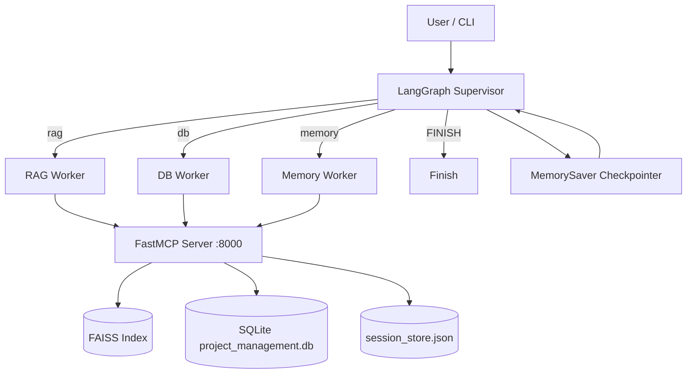

# Assignment 15 — Unified Engineering Assistant (Capstone)

**Track:** Multi-Agent Systems Engineering · **Difficulty:** Hard · **Marks:** 10 · **Est. time:** ~3 hrs

Supervisor capstone that routes each query to RAG, database, or memory workers via FastMCP — with FAISS, SQLite, and MemorySaver in one session (`thread_id = capstone-session-01`).

**Problem statement:** [`unified_engineering_assistant_assignment.md`](unified_engineering_assistant_assignment.md)

---

## Overview

Engineering teams need one assistant for three question types without switching modes. A **Supervisor** classifies each query and routes it to the right specialist. All specialists call tools through a running FastMCP server. Session memory persists so a later “what have I asked?” turn can recap earlier RAG and DB work.

### What you will practice

- LangGraph supervisor pattern with MemorySaver checkpointer
- FastMCP HTTP tools (`rag_search`, `db_query`, `get_session_history`)
- FAISS knowledge base + SQLite project analytics + session store
- Ambiguous hybrid routing (Query 4 → `rag` with session context)
- Thin CLI shim → `runner` → `commands` / `output`

### Tech stack

| Component | Choice |
|-----------|--------|
| Orchestration | LangGraph + MemorySaver |
| Tool protocol | FastMCP (streamable HTTP) |
| Knowledge base | FAISS (`faiss_index/`) |
| Project data | SQLite (`data/project_management.db`) |
| LLM API | OpenAI |
| Config | python-dotenv + pydantic-settings |
| Tests | pytest (mocked LLM + `tool_handler` MCP) |

---

## Project structure

```
15_unified_engineering_assistant/
├── engineering_assistant.py         # CLI entry shim
├── mcp_server.py                    # FastMCP: rag_search, db_query, get_session_history
├── rebuild_index.py                 # FAISS index from Wikipedia corpus
├── seed_db.py                       # project_management.db seed script
├── app/
│   ├── config.py                    # Paths, HELP_TEXT, assignment .env only
│   ├── cli/
│   │   ├── commands.py              # ask + demo handlers, run_query
│   │   ├── runner.py                # argv dispatch and exit codes
│   │   └── output.py                # routing / MCP / session printing
│   ├── graph/
│   │   ├── state.py                 # AssistantState TypedDict
│   │   ├── nodes.py                 # supervisor + rag / db / memory / finish
│   │   └── builder.py               # StateGraph + MemorySaver
│   ├── schemas/
│   │   └── prompts.py               # Supervisor + RAG synthesis prompts
│   └── services/
│       ├── llm_service.py, mcp_client.py, router.py
│       ├── session_store.py, rag_tool.py, db_tool.py
│       ├── ingestion.py, vector_store.py, sql_parser.py
├── tests/
├── .env.example
├── unified_engineering_assistant_assignment.md
├── pytest.ini
├── requirements.txt
└── README.md
```

---

## Architecture



Five integrated components:

| Component | Role |
|-----------|------|
| **LangGraph** | Supervisor routes each query to the correct worker |
| **FastMCP** | Workers call tools through the MCP protocol (HTTP) |
| **FAISS** | `rag_search` returns top-3 knowledge-base chunks |
| **SQLite** | `db_query` answers project-data questions |
| **MemorySaver** | Persists `session_history` across turns with `thread_id` |

---

## Prerequisites

- Python 3.10+
- OpenAI API key (live runs + FAISS rebuild)
- Two terminals: MCP server + assistant CLI

---

## Setup

```bash
cd "02. Multi-Agent System Engineering/Assignments/15_unified_engineering_assistant"
python -m venv .venv
.venv\Scripts\activate          # Windows
# source .venv/bin/activate     # macOS / Linux
pip install -r requirements.txt
copy .env.example .env          # Windows
# cp .env.example .env          # macOS / Linux
```

Edit `.env` (assignment folder only — never commit it):

| Variable | Required | Default | Description |
|----------|----------|---------|-------------|
| `OPENAI_API_KEY` | Yes (live / rebuild) | — | OpenAI API key |
| `OPENAI_MODEL` | No | `gpt-4o-mini` | Model for supervisor and synthesis |
| `MCP_SERVER_URL` | No | `http://127.0.0.1:8000/mcp` | Running MCP server endpoint |

| Constant | Value | Description |
|----------|-------|-------------|
| `THREAD_ID` | `capstone-session-01` | Shared MemorySaver / session thread |
| `RAG_K` | `3` | FAISS neighbours returned by `rag_search` |
| `MCP_SERVER_PORT` | `8000` | Port used by `mcp_server.py` |

Backend setup (once):

```bash
python rebuild_index.py   # FAISS knowledge base
python seed_db.py         # project_management.db
```

---

## Run

Live runs use **two terminals**. Start the MCP server first.

**Terminal 1 — MCP server (keep running):**

```bash
python mcp_server.py
```

Listens at `http://127.0.0.1:8000/mcp`. If the assistant cannot reach it, you get a clear error with this start command.

**Terminal 2 — assistant:**

### Single question

```bash
python engineering_assistant.py "Which of our tasks are currently blocked?"
```

### Full 4-query capstone demo

```bash
python engineering_assistant.py demo
```

Uses `thread_id = capstone-session-01` across all four turns.

### Help

```bash
python engineering_assistant.py --help
```

---

## Supervisor routes

| Route | Query type | Examples |
|-------|-----------|----------|
| `rag` | Engineering concepts, methodology | microservices vs monolith, DevOps practices |
| `db` | Project data | blocked tasks, assignees, incidents |
| `memory` | Session recap | What have I asked you so far? |
| `FINISH` | Done signals | Thanks, that's all |

### Ambiguous query (Query 4)

Query: *Based on our conversation, are there DevOps best practices I should apply to the blocked tasks?*

This spans session context, project data, and methodology. The supervisor detects ambiguity (conversation + blocked tasks + DevOps) and routes to **`rag`**, injecting session context into the RAG worker so DevOps guidance references the earlier blocked-task discussion. The answer is prefixed with `AMBIGUOUS_NOTE`.

---

## 4-query test session

| # | Query | Expected route |
|---|-------|----------------|
| 1 | What is the difference between microservices and a monolith? | `rag` |
| 2 | Which of our tasks are currently blocked? | `db` |
| 3 | What have I asked you so far? | `memory` |
| 4 | DevOps best practices for blocked tasks (ambiguous) | `rag` |

Query 3 must reference Query 1 (microservices / `rag`) and Query 2 (blocked tasks / `db`).

### Sample routing trace

```
============================================================
  Unified Engineering Assistant
============================================================

Query (capstone-session-01): What is the difference between microservices and a monolith?

[supervisor] route=rag for: What is the difference between microservices and a monolith?
  MCP call: rag_search({'query': '...'})
    -> Result 1 (Source: Microservices): ...
Answer: Microservices deploy independently while monoliths ship as one unit.

[session] history:
  Turn 1: [rag] What is the difference... -> Microservices deploy independently...
```

After Query 3, history should look similar to:

```
Turn 1: [rag] What is the difference between microservices and a monolith? -> ...
Turn 2: [db] Which of our tasks are currently blocked? -> ...
```

---

## FastMCP tools

| Tool | Description |
|------|-------------|
| `rag_search(query)` | FAISS top-3 chunks as `Result N (Source: title): text` |
| `db_query(question)` | SELECT-only analytics against `project_management.db` |
| `get_session_history(thread_id)` | Formatted recap or `No prior queries in this session` |

Tests inject `MCPClientWrapper(tool_handler=...)` — no live MCP subprocess in pytest.

---

## Tests

```bash
python -m pytest tests/ -v
```

No live API key or running MCP server is required for pytest.

---

## Submission checklist

- [ ] FastMCP server with all 3 tools committed
- [ ] `rebuild_index.py` + `seed_db.py` — evaluator sets up backends in 2 commands
- [ ] MCP server started separately before live CLI runs
- [ ] Query 3 response references Query 1 and Query 2 topics / workers
- [ ] Architecture diagram shows FAISS, FastMCP, SQLite, LangGraph, MemorySaver
- [ ] `thread_id` used consistently across the 4-query demo
- [ ] Do not commit `.env`
