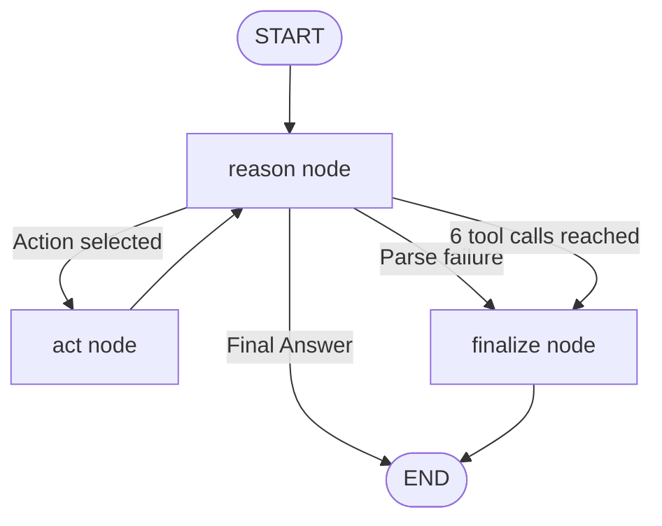

# Assignment 06 — Developer Assist Agent

ReAct developer assistant built with LangGraph. The agent loops through Thought → Action → Observation until it can answer, with a 6-tool-call safety guard.

**Problem statement:** [developer_assist_agent_assignment.md](developer_assist_agent_assignment.md)

## Project layout

```
06_developer_assist_agent/
├── developer_assist_agent_assignment.md
├── developer_assist.py              # CLI entry shim
├── data/sample_langgraph_readme.txt # Sample doc for demo query 3
├── app/
│   ├── main.py                      # public exports
│   ├── config.py
│   ├── cli/
│   │   ├── runner.py                # ask + demo commands, run_agent
│   │   └── output.py                # ReAct trace printing
│   ├── graph/
│   │   ├── state.py                 # AgentState TypedDict
│   │   ├── nodes.py                 # reason / act / finalize nodes
│   │   └── builder.py               # StateGraph wiring
│   ├── schemas/prompts.py
│   └── services/
│       ├── llm_service.py
│       ├── react_parser.py
│       ├── tools.py                 # story_estimator, tech_stack_advisor, doc_summariser
│       └── tool_dispatcher.py
└── tests/
```

## Architecture



## Setup

```bash
cd "00. Notes & Documents/01. Agentic AI Training/02. Multi-Agent Systems Engineering/Assignments/06_developer_assist_agent"
python -m venv .venv
.venv\Scripts\activate
pip install -r requirements.txt
copy .env.example .env
# Add your OpenAI API key
```

## Run

Ask a single question:

```bash
python developer_assist.py "What stack should I use to build a real-time notification system?"
```

Run all four evaluator sample queries:

```bash
python developer_assist.py demo
```

## Tools

| Tool | Purpose |
|------|---------|
| `story_estimator` | Story point estimate (1/2/3/5/8/13) with 2-sentence rationale |
| `tech_stack_advisor` | 2–3 framework/tool recommendations with reasons |
| `doc_summariser` | Exactly 3 one-sentence bullet points from documentation |

Import from `app.main` or the individual service modules.

## Tests

```bash
pytest tests/ -v
```

Tests mock the OpenAI client — no live API calls required.

## ReAct trace format

Each loop prints:

```
Thought: ...
Action: story_estimator
Action Input: ...
Observation: ...

Final Answer: ...
Stopped: final_answer
```

When the 6-tool-call guard triggers, the agent synthesises the best answer from the scratchpad and stops with `Stopped: max_iterations`.

## Sample demo queries

1. CSV export effort estimate → `story_estimator`
2. Real-time notification stack → `tech_stack_advisor`
3. Summarise committed LangGraph sample doc → `doc_summariser`
4. OAuth login stack + effort → `tech_stack_advisor` then `story_estimator`

Capture console output from `python developer_assist.py demo` for your README transcript.
